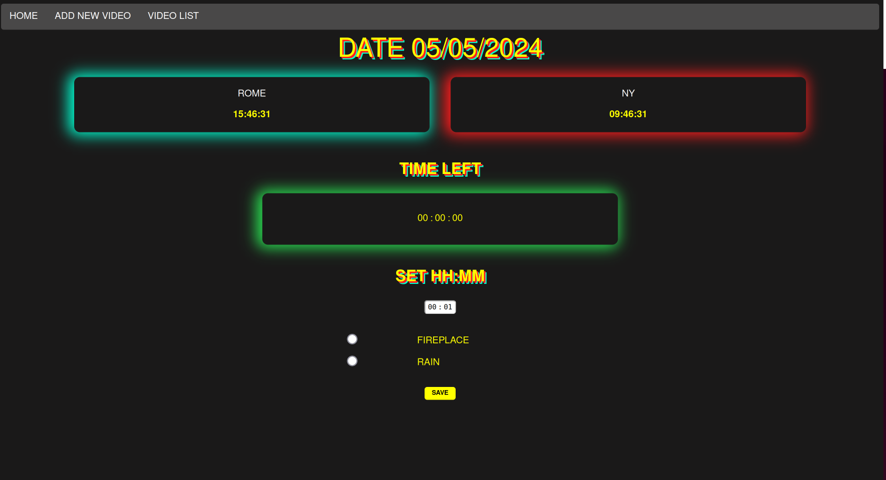
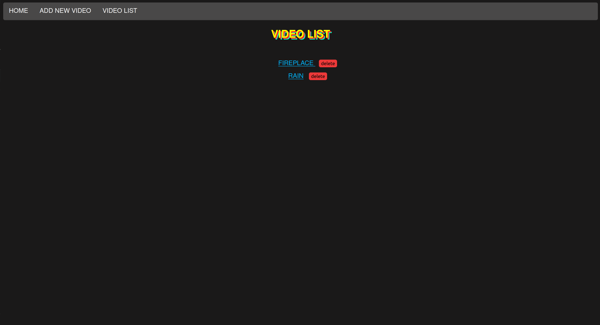

Online Timer

This website is build in node js using the framework Express and using a MongoDB. 

Installation:
1. docker-compose up -d
2. docker-compose exec -u root node bash
3. Execute npm init for init the project 
4. Execute npm install express 
5. Execute npm install express-generator -g 
6. Execute express  --view=pug
7. Execute npm install cookie-parser
8. Execute npm install -g nodemon 
9. Execute npm install -g mongodb
10. To run your application esecute nodemon
11. Open in your browser http://localhost:8001/

